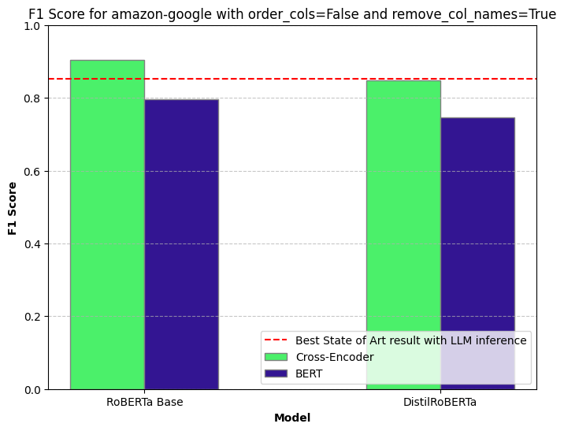

# WavER: A Unified Pipeline for Scalable Entity Resolution

**Advancing Entity Resolution: Creating a Unified Pipeline for Scalable Blocking and Accurate Matching**

Link to the paper: [KTH DIVA](https://urn.kb.se/resolve?urn=urn:nbn:se:kth:diva-367531)

## 📌 Overview

WavER (Wavestone Entity Resolution) is a comprehensive entity resolution pipeline designed to improve accuracy and
scalability across diverse datasets. It integrates various blocking techniques, supervised and unsupervised matching
models, and explores recent advances in zero-shot and few-shot learning using Large Language Models (LLMs).

This project builds on benchmark results in entity resolution, comparing against state-of-the-art methods from _Papers
with Code_ and other industry benchmarks.

## 🚀 Features

- **Blocking Techniques**: Scalable candidate pair reduction to improve efficiency with graph-based and rule-based
  strategies.
- **Pairwise Matching Models**: Supervised and unsupervised approaches for entity matching.
- **LLM-Based Matching**: Zero-shot and few-shot learning approaches for adaptable resolution.
- **Benchmark Comparisons**: Evaluation against existing entity resolution models.

## 📂 Repository Structure

```bash
WavER/
│── data/ # Datasets and preprocessed data
│── graphs/ # Graphs representations for entity resolution
│── model/ # Trained models and evaluation scripts
│── pages/ # StreamLit application pages
│── papers/ # Related research papers and benchmarks
│── results/ # Benchmark comparisons and results
│── src/ # Core pipeline implementation
│ │── bert/ # Pairwise entity matching models
│ │── blocking/ # Blocking strategies
│ │── cross-encoder/ # Graph-based entity resolution
│ │── zero-shot/ # Zero-shot and few-shot entity matching
│── README.md # Project documentation
│── requirements.txt # Dependencies
│── Matching.py # StreamLit application entry point
```

## 📊 Results

The pipeline has been tested on multiple datasets, demonstrating improvements in both accuracy and efficiency. Key findings include:

- **Reduction in candidate pairs via efficient blocking**
- **Supervised models outperform traditional baselines**
- **Graph-based methods enhance clustering performance**
- **LLM-based zero-shot matching provides robust generalization** in unseen datasets.



For detailed results, see the [Results Section](./results/) or refer to the [Master's Thesis](https://urn.kb.se/resolve?urn=urn:nbn:se:kth:diva-367531).

## 🔧 Installation

To set up the environment:

```bash
git clone https://github.com/ttperr/WavER.git
cd WavER
pip install -r requirements.txt
```

## ▶️ Usage

Run the POC using:

```bash
streamlit run Matching.py
```

## 📖 Citation

If you find this work useful, please consider citing:

```bibtex
@phdthesis{Perrot_2025,
	title        = {Advancing Entity Resolution: Creating a Unified Pipeline for Scalable Blocking and Accurate Matching : A Study of Supervised and Unsupervised Methods, Graph-Based Approaches and Transformers},
	author       = {Perrot, Tristan},
	year         = 2025,
	series       = {TRITA-EECS-EX},
	url          = {https://urn.kb.se/resolve?urn=urn:nbn:se:kth:diva-367531},
	abstractnote = {Entity Resolution (ER), the task of identifying and linking records that refer to the same real-world entity, is a cornerstone of data integration and analytics. However, achieving both scalability and accuracy in ER pipelines remains a persistent challenge, as traditional methods struggle with large datasets, noisy data, and computational complexity. This problem is significant due to its critical role in domains such as e-commerce, healthcare, and scientific research, where data consolidation and consistency are vital. Despite the wealth of existing research, the complexity of balancing high performance in both blocking and matching stages has left significant room for improvement, making it a suitable and impactful topic for a master's thesis. To address this, I conducted a comprehensive study of ER techniques, focusing on both blocking and matching. I explored graph-based approaches for blocking to improve scalability and reduce computational overhead. For the matching phase, I leveraged supervised learning using a cross-encoder architecture based on the Sentence bidirectional encoder representations from transformers (SBERT) framework, achieving state-of-the-art results. Additionally, I investigated unsupervised graph-based methods with SBERT embeddings and the potential of Large Language Models (LLMs) for zero-shot inference. By integrating these techniques, I developed a robust and scalable pipeline capable of handling diverse datasets and scenarios. The results demonstrate that supervised matching with cross-encoders significantly outperforms other approaches (even the state-of-art ones) in accuracy, while graph-based and unsupervised methods provide valuable scalability and adaptability insights. This thesis not only benchmarks the performance of these methods against state-of-the-art approaches but also offers a unified perspective on current techniques while providing a POC. The findings enable researchers and practitioners to design more effective pipelines, bridging the gap between scalability and precision, and paving the way for future innovations in the field.},
	collection   = {TRITA-EECS-EX},
}
```

## 📫 Contact

For questions or feedback, please reach out to me.
